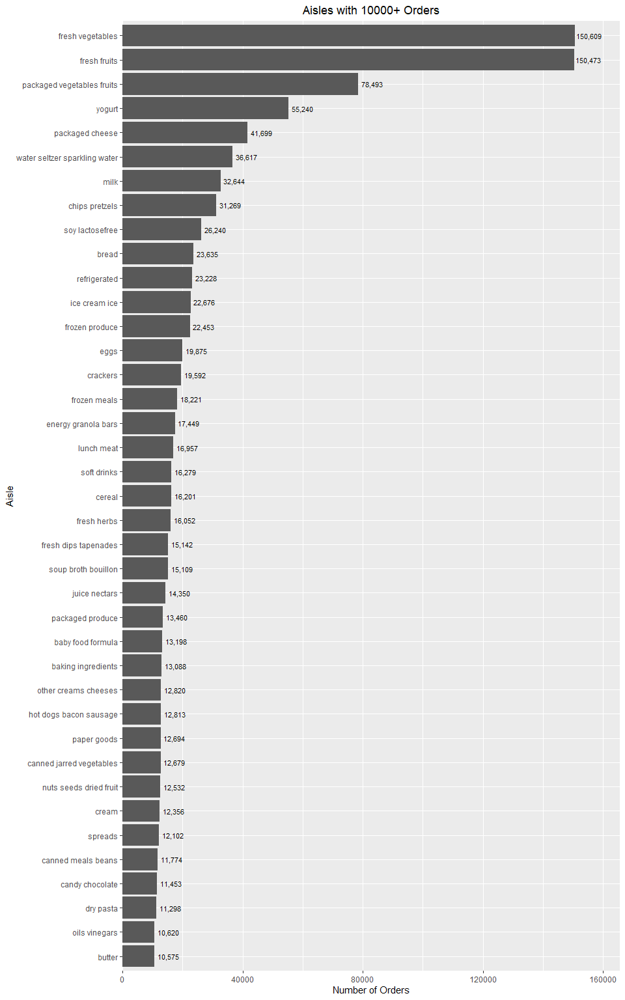

p8105_hw3_yl2625
================
Yurou Liu
2025-10-07

## Problem 1

load in data

``` r
library(dplyr)
```

    ## 
    ## Attaching package: 'dplyr'

    ## The following objects are masked from 'package:stats':
    ## 
    ##     filter, lag

    ## The following objects are masked from 'package:base':
    ## 
    ##     intersect, setdiff, setequal, union

``` r
library(p8105.datasets)

data("instacart") 
insta_ez_to_read = instacart %>% 
  select(aisle, everything())
```

``` r
# group by same aisles and sum up the order number for the same group 
total_aisle_df = insta_ez_to_read %>% 
  group_by(aisle) %>% 
  summarise(total_orders = n(), aisle = first(aisle)) %>%
  arrange(desc(total_orders))

# count the number of different aisles
num_aisles = n_distinct(total_aisle_df$aisle)

# find out the best seller
best_seller = total_aisle_df %>% 
  # pick out the aisle with the most orders, of there are aisles with the same number of orders, they will be picked out together
  filter(total_orders == max(total_orders))

print(num_aisles)
```

    ## [1] 134

``` r
print(best_seller)
```

    ## # A tibble: 1 × 2
    ##   aisle            total_orders
    ##   <chr>                   <int>
    ## 1 fresh vegetables       150609

According to the printed results, there are 134 different aisles, and
the most items are ordered from fresh vegetables, with 150609 orders in
total.

### make a plot

``` r
plot_df = total_aisle_df %>% 
  filter(total_orders > 10000)

library(ggplot2)

plot_df %>% 
  ggplot(aes(y = reorder(aisle, total_orders), x = total_orders)) + 
  geom_col() +
  labs(title = "Aisles with 10000+ Orders", x = "Number of Orders", y = "Aisle") + 
  # add order number labels to the columns.
  geom_text(aes(label = format(total_orders, big.mark = ",")), hjust = -.05, size = 3) + 
  # expand x axis from the right side.
  scale_x_continuous(expand = expansion(mult = c(0, .1))) + 
  theme(plot.title = element_text(hjust = .5))
```

<!-- -->

### Table: three most popular items in ‘baking ingredients’, ‘dog food care’ and ‘packaged vegetables fruits’ with number of orders.

``` r
df_for_table = insta_ez_to_read %>% 
  select(aisle, product_name) %>% 
  group_by(product_name) %>% 
  summarise(total_orders = n(), 
            aisle = first(aisle)) %>% 
  filter(aisle %in% c("baking ingredients", "dog food care", "packaged vegetables fruits" )) %>% 
  group_by(aisle) %>% 
  slice_max(total_orders, n = 1) %>% 
  ungroup() %>% 
  select(aisle, everything()) %>% 
  print()
```

    ## # A tibble: 3 × 3
    ##   aisle                      product_name                           total_orders
    ##   <chr>                      <chr>                                         <int>
    ## 1 baking ingredients         Light Brown Sugar                               499
    ## 2 dog food care              Snack Sticks Chicken & Rice Recipe Do…           30
    ## 3 packaged vegetables fruits Organic Baby Spinach                           9784

### Table: mean hour of the day at which pink lady apples and coffee ice cream are ordered on each day of the week.

``` r
library(tidyr)

df_for_table2 = insta_ez_to_read %>% 
  select(product_name, order_dow, order_hour_of_day) %>% 
  filter(product_name %in% c("Pink Lady Apples", "Coffee Ice Cream")) %>% 
  group_by(product_name) %>% 
  mutate(row_id = row_number()) %>% 
  pivot_wider(names_from = product_name, 
              values_from = order_hour_of_day) %>% 
  select(-row_id) %>% 
  arrange(order_dow) %>% 
  group_by(order_dow) %>% 
  summarise(mean_order_hour_apples = mean(`Pink Lady Apples`, na.rm = TRUE), 
         mean_order_hour_icecream = mean(`Coffee Ice Cream`, na.rm = TRUE)) %>% 
  mutate(order_dow = recode(order_dow, 
                            `0` = "Sunday", 
                            `1` = "Monday", 
                            `2` = "Tuesday", 
                            `3` = "Wednesday", 
                            `4` = "Thursday", 
                            `5` = "Friday", 
                            `6` = "Saturday")) %>% 
  print()
```

    ## # A tibble: 7 × 3
    ##   order_dow mean_order_hour_apples mean_order_hour_icecream
    ##   <chr>                      <dbl>                    <dbl>
    ## 1 Sunday                      13.4                     13.8
    ## 2 Monday                      11.4                     14.3
    ## 3 Tuesday                     11.7                     15.4
    ## 4 Wednesday                   14.2                     15.3
    ## 5 Thursday                    11.6                     15.2
    ## 6 Friday                      12.8                     12.3
    ## 7 Saturday                    11.9                     13.8
